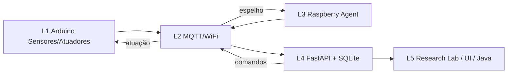

# Arquitetura de Engenharia — SmartHome IoT Platform

## Objetivo científico

Plataforma experimental para estudar **sincronização edge** entre nós heterogêneos (**Arduino/ESP32** e **Raspberry Pi**), com atuação eletromecânica (servos/portas/relés) e coleta quantitativa de métricas para avaliação em contexto de doutorado.

## Camadas (L1–L5)

| Camada | Nome | Responsabilidade |
|--------|------|------------------|
| L1 | Percepção / Atuação | Sensores, GPIO, servos, relés, portas |
| L2 | Comunicação | MQTT, REST, WebSocket |
| L3 | Edge Coordination | Agente Raspberry, heartbeat, espelhamento |
| L4 | Serviço / Persistência | FastAPI, SQLite, telemetria, auditoria |
| L5 | Experimentação | Simulador visual, Research Lab, export CSV/JSON |

## Fonte de verdade

- Em runtime: `HouseState` (memória) versionado (`state_version`)
- Persistência: leituras de sensores, dispositivos e logs em SQLite
- Observabilidade: `TelemetryEngine` (latência, skew, SQI)

## Índice de Qualidade de Sincronia (SQI)

$$
SQI = 0.45\cdot S_{skew} + 0.30\cdot S_{jitter} + 0.25\cdot S_{reliability}
$$

- \(S_{skew}\): penaliza desalinhamento temporal Arduino↔Raspberry
- \(S_{jitter}\): estabilidade do intervalo de heartbeat
- \(S_{reliability}\): taxa de eventos de dessincronia

Faixa: **0–100** (maior = melhor).

## Fluxo de comando

1. UI / Java / API emite comando
2. Servidor valida e atualiza `HouseState`
3. Telemetria registra latência do caminho de controle
4. Broadcast WebSocket atualiza o simulador
5. MQTT (opcional) propaga para firmware / agente
6. Auditoria grava log em SQLite

## Segurança (baseline acadêmico)

- JWT na API de autenticação
- Senhas com bcrypt
- Logs de auditoria por ação
- MQTT TLS e HTTPS recomendados em deploy real (ver `docs/METHODOLOGY.md`)
