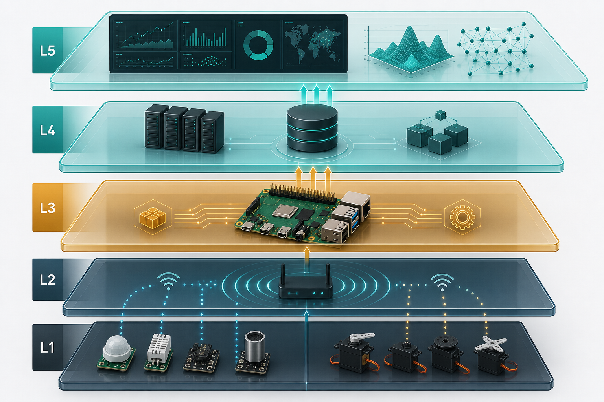
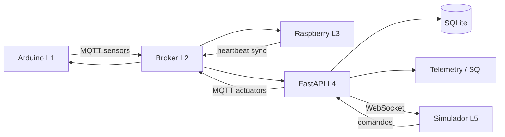
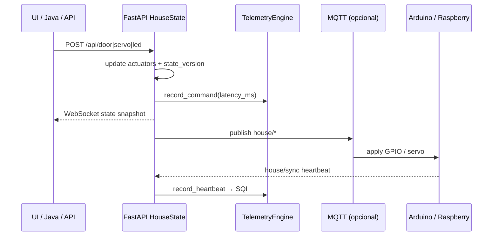
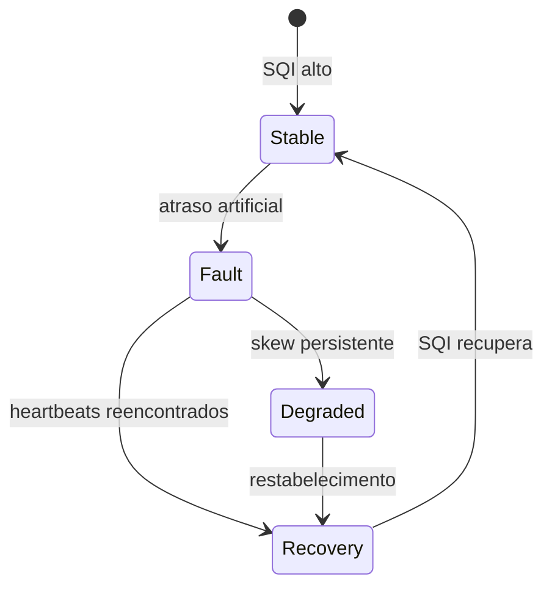

# SmartHome IoT Platform

[](./LICENSE)
[](./docs/PROTOCOL.md)
[](#arquitetura-de-engenharia-l1l5)
[](./docs/METHODOLOGY.md)

<p align="center">
  
</p>

<p align="center">
  <strong>Bancada experimental de IoT edge</strong> para sincronização Arduino ↔ Raspberry,<br/>
  atuação eletromecânica e coleta quantitativa de evidências — pensada para <em>apresentação de doutorado</em>.
</p>

<p align="center">
  <a href="https://htmlpreview.github.io/?https://raw.githubusercontent.com/CanonEngineer/SmartHomeIOT/main/docs/demo/standalone.html">
    
  </a>
  &nbsp;
  <a href="https://github.com/CanonEngineer/SmartHomeIOT/blob/main/docs/demo/standalone.html">
    
  </a>
  &nbsp;
  <a href="./docs/ARCHITECTURE.md">
    
  </a>
</p>

> **▶ Abrir Interface Gráfica AGORA** abre o simulador imediatamente (não depende do Pages).<br/>
> O link `github.io/.../demo/` só funciona depois de ativar Pages em Settings (veja seção abaixo).<br/>
> Laboratório completo local: `start.ps1` → `http://127.0.0.1:8000`.

---

## Sumário

- [Por que este projeto](#por-que-este-projeto)
- [Abrir a interface](#abrir-a-interface)
- [Arquitetura de engenharia (L1–L5)](#arquitetura-de-engenharia-l1l5)
- [Fluxogramas](#fluxogramas)
- [Protocolo e tópicos MQTT](#protocolo-e-tópicos-mqtt)
- [Research Lab & métricas](#research-lab--métricas)
- [Estrutura do repositório](#estrutura-do-repositório)
- [Quick start](#quick-start)
- [Hardware](#hardware)
- [API](#api)
- [Documentação científica](#documentação-científica)
- [Testes](#testes)
- [Licença](#licença)

---

## Por que este projeto

Este repositório não é apenas um “curso de IoT”. É uma **plataforma de experimentação** com:

| Capacidade | Valor científico |
|------------|------------------|
| Sync Arduino ↔ Raspberry | Estudo de coordenação edge heterogênea |
| Servos / portas / relés | Cadeia percepção → atuação eletromecânica |
| SQI (Sync Quality Index) | Indicador composto (skew + jitter + confiabilidade) |
| Fault injection | Observar degradação e recuperação |
| Export CSV/JSON | Reprodutibilidade e tabelas para tese |
| Simulador visual | Demonstração interativa em banca/defesa |

<p align="center">
  
</p>

---

## Abrir a interface

### Opção A — Botão online (Demo Lab)

<p align="center">
  <a href="https://htmlpreview.github.io/?https://raw.githubusercontent.com/CanonEngineer/SmartHomeIOT/main/docs/demo/standalone.html">
    
  </a>
</p>

- **Backup imediato (funciona sem configurar Pages):** [Abrir standalone](https://htmlpreview.github.io/?https://raw.githubusercontent.com/CanonEngineer/SmartHomeIOT/main/docs/demo/standalone.html)
- **GitHub Pages (após ativar):** https://canonengineer.github.io/SmartHomeIOT/demo/

Para ativar Pages no repositório:

1. Abra [Settings → Pages](https://github.com/CanonEngineer/SmartHomeIOT/settings/pages)
2. Em **Build and deployment → Source**, escolha **GitHub Actions**
   - ou **Deploy from a branch** → branch `main` → folder `/docs`
3. Aguarde 1–2 minutos e recarregue o link `/demo/`

Funciona direto no browser: casa virtual, Arduino/Raspberry, luzes, portas, servos e painel Research Lab em **modo demo**.

### Opção B — Laboratório completo (local)

```powershell
git clone https://github.com/CanonEngineer/SmartHomeIOT.git
cd SmartHomeIOT
.\start.ps1
```

Depois abra: **http://127.0.0.1:8000**

Isso ativa FastAPI, WebSocket, SQLite, telemetria real e exportação de experimentos.

---

## Arquitetura de engenharia (L1–L5)

<p align="center">
  
</p>

| Camada | Nome | Componentes |
|--------|------|-------------|
| **L1** | Percepção / Atuação | Arduino/ESP32, DHT22, LDR, PIR, relés, servos, portas |
| **L2** | Comunicação | Wi-Fi, MQTT (`house/*`), REST, WebSocket |
| **L3** | Edge Coordination | Agente Raspberry Pi, heartbeat, espelhamento de estado |
| **L4** | Serviço / Persistência | FastAPI, SQLite, telemetria, auditoria JWT/bcrypt |
| **L5** | Experimentação | Simulador web, Research Lab, Java Dashboard, CSV/JSON |

Detalhes: [`docs/ARCHITECTURE.md`](./docs/ARCHITECTURE.md)

---

## Fluxogramas

### Pipeline ponta a ponta



### Ciclo de comando (atuação)



### Experimento com falha (fault injection)



---

## Protocolo e tópicos MQTT

Protocolo versionado: **`v1.0.0`** — [`docs/PROTOCOL.md`](./docs/PROTOCOL.md)

| Tópico | Direção | Payload |
|--------|---------|---------|
| `house/temp` `humidity` `light` `motion` | device → edge | sensor value |
| `house/led` `relay` `buzzer` `servo` `door` | edge → device | comando de atuação |
| `house/sync` | bidirecional | heartbeat Arduino/Raspberry |

Envelope lógico inclui `protocol`, `message_id`, `source`, `timestamp_utc`, `qos`, `payload`.

---

## Research Lab & métricas

### Sync Quality Index (SQI)

\[
SQI = 0.45\cdot S_{skew} + 0.30\cdot S_{jitter} + 0.25\cdot S_{reliability}
\]

Faixa **0–100**. Usado como indicador composto na defesa/tese.

### Experimentos prontos

| ID | Objetivo |
|----|----------|
| `sync_latency` | Skew Arduino ↔ Raspberry |
| `actuator_response` | Latência de atuação (p50/p95) |
| `fault_injection` | Queda e recuperação do SQI |
| `end_to_end` | Consistência welcome → garage → night |

Exports em `experiments/exports/*.csv` e `*.json`.

Endpoints:

- `GET /api/research/overview`
- `GET /api/research/telemetry`
- `POST /api/research/experiments/run`
- `GET /api/research/thesis-brief.md`

Metodologia: [`docs/METHODOLOGY.md`](./docs/METHODOLOGY.md)

---

## Estrutura do repositório

```text
SmartHomeIOT/
├── arduino/SmartHomeNode/   # Firmware ESP32/Arduino + MQTT
├── raspberry/               # Agente edge (GPIO ou espelho API)
├── python_server/           # FastAPI + telemetria + experimentos
├── java_client/             # Dashboard desktop Swing
├── web/                     # UI acoplada ao backend local
├── docs/
│   ├── assets/              # Ilustrações e diagramas
│   ├── demo/                # Interface gráfica (GitHub Pages)
│   ├── ARCHITECTURE.md
│   ├── PROTOCOL.md
│   └── METHODOLOGY.md
├── experiments/exports/     # Resultados CSV/JSON
├── tests/                   # Testes de engenharia
├── docker-compose.yml       # Mosquitto opcional
└── start.ps1
```

---

## Quick start

### Windows

```powershell
.\start.ps1
```

### Manual

```powershell
cd python_server
python -m venv .venv
.\.venv\Scripts\Activate.ps1
pip install -r requirements.txt
python app.py
```

### MQTT (opcional)

```powershell
docker compose up -d
# defina MQTT_ENABLED=true no ambiente do servidor
```

### Raspberry agent

```powershell
cd raspberry
pip install -r requirements.txt
$env:USE_MQTT="0"   # espelha via API se não houver broker
python agent.py
```

---

## Hardware

### Arduino / ESP32
- DHT22, LDR, PIR
- Relé 4 canais, LED, buzzer
- 2× servo (portas) + 1× servo braço  
Pinout: [`arduino/PINOUT.md`](./arduino/PINOUT.md)

### Raspberry Pi
- Coordenação edge + GPIO local (ou stub em PC)

---

## API

| Método | Rota | Descrição |
|--------|------|-----------|
| GET | `/api/status` | Estado + telemetria |
| POST | `/api/led` `/relay` `/servo` `/door` | Atuação |
| POST | `/api/simulate` | Cenários |
| WS | `/api/ws` | Tempo real |
| * | `/api/research/*` | Bancada científica |
| GET | `/docs` | OpenAPI interativa |

Login default: `admin` / `admin123`

---

## Documentação científica

| Documento | Conteúdo |
|-----------|----------|
| [ARCHITECTURE](./docs/ARCHITECTURE.md) | Camadas, fonte de verdade, SQI |
| [PROTOCOL](./docs/PROTOCOL.md) | Contratos MQTT / envelope |
| [METHODOLOGY](./docs/METHODOLOGY.md) | Ensaios, hipóteses, ameaças à validade |

---

## Testes

```powershell
cd python_server
.\.venv\Scripts\python.exe ..\tests\test_engineering.py
```

---

## Licença

Código de autoria própria para fins **educacionais e de pesquisa**.  
Não reproduz conteúdo proprietário de cursos comerciais.

---

<p align="center">
  <a href="https://htmlpreview.github.io/?https://raw.githubusercontent.com/CanonEngineer/SmartHomeIOT/main/docs/demo/standalone.html">
    
  </a>
</p>

<p align="center">
  <sub>CanonEngineer · SmartHomeIOT · Protocol v1.0.0</sub>
</p>
